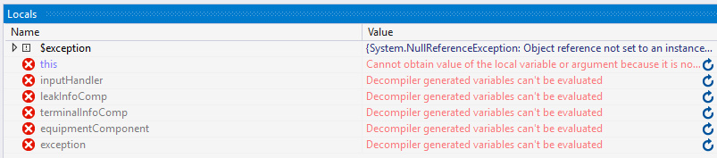
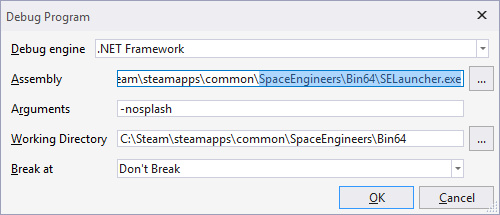

These are if you're already a bit comfortable with what [dnSpy](Advanced-debugging-with-dnSpy#getting-dnspy) is and how to use its [decompiled code navigation](Advanced-debugging-with-dnSpy#looking-at-the-compiled-code) and [basic debugging](Advanced-debugging-with-dnSpy#catching-errors-exceptions).

## Breakpoints

These pause the code execution at a specific line just like exceptions, but you don't need an error or to edit the code to do it, just right-click on any code line to add a breakpoint.

When dnSpy is attached and the game goes over your breakpoints it will pause the execution just like an exception (relevant: [Navigating paused code](Advanced-debugging-with-dnSpy#navigating-paused-code)).

##### Breakpoints for PB/mod scripts.

Mods and PB scripts are compiled in memory and can be found in Debug -> Windows -> Modules (Ctrl+Alt+U, requires dnSpy to be attached) at the end, PB scripts have `<EntityId>-<CustomName>.dll` name format.

When you recompile a PB or reload a world the scripts are compiled into *new modules*, that means you need to open the new one.

Or you can avoid that module fiddling and just throw exceptions inside a try-catch in your own code to act like a breakpoint (relevant: [Catching errors (exceptions)](Advanced-debugging-with-dnSpy#catching-errors-exceptions)).

## Seeing local variables when code is paused

Local variables are optimized out so in order to see their values when execution is paused you need to have the libraries start as unoptimized.

**Note:** Simply attaching dnSpy to the game will cause any future in-game compilations to be built unoptimized (mods recompile on world load, PBs can be recompiled in terminal), that means you don't need to use this launcher for seeing PB/mod code but you do need to attach before you compile them.

But for game's code you need to start the game with dnSpy in order to load its libraries as unoptimized.

However starting the game directly with dnSpy won't work, it needs a launcher to set some proper Steam stuff.

**Note:** Starting the game with dnSpy will run noticeably slower.

##### Starting the game with dnSpy:

1. Get the "SE launcher":

   - Download: [SELauncher.exe](binaries/SELauncher.exe)

   - Or build it yourself from [its source code (SELauncher.cs)](snippets/SELauncher.cs)

2. Place `SELauncher.exe` in the game's Bin64 (e.g. `<Steam>/SteamApps/common/SpaceEngineers/Bin64`)

3. Start dnSpy (but not the game).

4. dnSpy: `Debug -> Start Debugging (F5)` and in Assembly pick the `SELauncher.exe` that you got/built.

   Optional: add `-nosplash` in the arguments.

   

5. Do your exception catching or breakpoint stuff.

6. Local variables now have values!

***

_A big thank you goes to Digi for writing this tutorial._