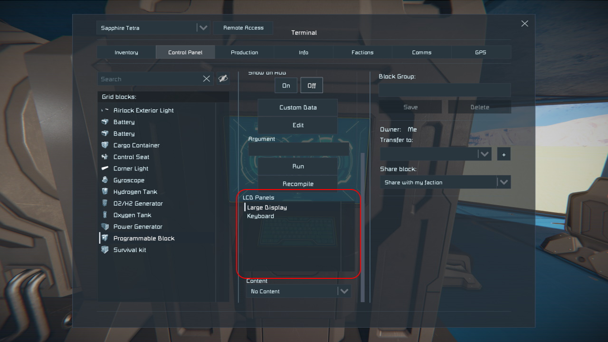
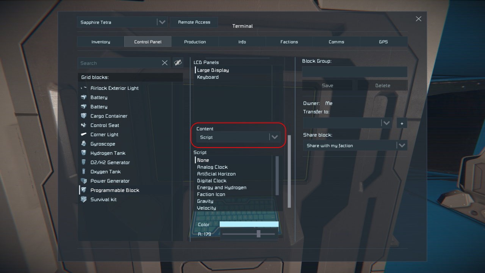
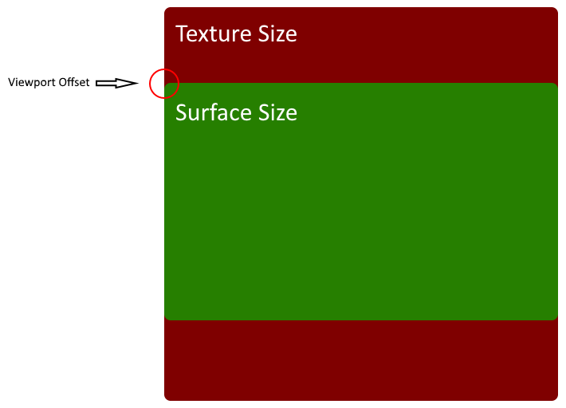

Some time ago we finally got a way to make more advanced and pretty screens using the programmable block. These **sprites** are really designed for use with the new LCD Script system (the script menu you get for each LCD panel) but we were also given the ability to draw these sprites using the programmable block.


### Configuring Text Surfaces

Every block with modifiable text surfaces will slow a list of text surfaces in the control panel.



For the programmable block, there's two. The number and names will vary across different blocks.

To manually set up a text surface for sprite drawing, select the text surface you wish to draw on, then select `Script` in the Content drop box below the surface list. A new set of controls will show up below the Content drop box.



The scripts listed in this list are _not_ programmable block scripts. They are special built-in (or modded) scripts that we cannot directly modify in-game. So, for our purposes, we want to make sure that we select `None`.
This will allow the programmable block to control the output of this text panel.

The sliders below control the background and foreground colors of the sprites. We will talk more about those later.

### Fetching Text Surfaces And Preparing The Script

In order to draw on a text surface, we need to retrieve it first. For the sake of this example, we will simply be working on the large text panel of the running programmable block, but the principle applies for all
blocks with scriptable text panels.

Every block with scriptable text panels implements the interface [`IMyTextSurfaceProvider`](Sandbox.ModAPI.Ingame.IMyTextSurfaceProvider). This interface contains the members we need to retrieve the text surface we 
want to draw on. We want to use the `GetSurface` method. It takes a single parameter, the index of the text surface to retrieve. These text surfaces are ordered the same way as we see in the list above, so in our
example we will want to retrieve the _first_ text panel, since that is the Large Display. Most indices in C# are 0-based, so we will want to retrieve surface 0.

The sprite system is designed to be continually updated. If you don't periodically update your display in sprite mode, it will fall back to the default image for that particular text surface. For this reason we need to set up [continuous execution of our script](Continuous-Running-No-Timers-Needed). For the sake of our simple demo script, we'll just update every 100 ticks. Update rates are maxed out at every 10 ticks for sprites, so updating _every_ tick is a waste of processing power.

```csharp
IMyTextSurface _drawingSurface;

// Script constructor
public Program()
{
    // Me is the programmable block which is running this script.
    // Retrieve the Large Display, which is the first surface
    _drawingSurface = Me.GetSurface(0);

    // Set the continuous update frequency of this script
    Runtime.UpdateFrequency = UpdateFrequency.Update100;
}
```
### The Viewport

There is a difference between the actual texture we draw on, and the area that is actually visible on the block. This visible Surface size is given to us through the `SurfaceSize` property, and the size of the texture we're drawing on is available through the `TextureSize` property.

The majority of the text surfaces _center_ this surface on its texture, like this:  


This means that in order to place our sprites where we _expect_ them to be within what we actually see, we'll need to calculate this offset. I choose to do this by creating a full `RectangleF` which describes both the offset and size of the area we actually see in the game.

Let's update our constructor with this new code.

```csharp
IMyTextSurface _drawingSurface;
RectangleF _viewport;

// Script constructor
public Program()
{
    // Me is the programmable block which is running this script.
    // Retrieve the Large Display, which is the first surface
    _drawingSurface = Me.GetSurface(0);

    // Set the continuous update frequency of this script
    Runtime.UpdateFrequency = UpdateFrequency.Update100;

    // Calculate the viewport offset by centering the surface size onto the texture size
    _viewport = new RectangleF(
        (_drawingSurface.TextureSize - _drawingSurface.SurfaceSize) / 2f,
        _drawingSurface.SurfaceSize
    );
}
```
#### A Caveat...

Once upon a time, an LCD mod was integrated into the vanilla game: The Corner LCDs. These corner LCDs does at the time of the writing of this tutorial, _not_ report the correct surface size, but a full texture size. Be aware of this.

### Drawing A Frame

The drawing API is for all intents and purposes quite low level. You tell the surface that you wish to start a new frame, then you create and add a bunch of sprites, then you tell the surface that you're done. 

```csharp
// Main Entry Point
public void Main(string argument, UpdateType updateType)
{
    // Begin a new frame
    var frame = _drawingSurface.DrawFrame();

    // All sprites must be added to the frame here
    DrawSprites(ref frame);

    // We are done with the frame, send all the sprites to the text panel
    frame.Dispose();
}
```

Note that every `DrawFrame` will overwrite the previous. You cannot have multiple `DrawFrame` calls within a single Main call.

### Drawing Sprites

Sprites are drawn by adding instructions to the MySpriteDrawFrame on how they should be drawn. This is done through the [`MySprite`](VRage.Game.GUI.TextPanel.MySprite) structure. It consists of the following fields:

|Member|Description|
|---|---|
|[Type](VRage.Game.GUI.TextPanel.MySprite.Type)|Type of sprite; either SpriteType.TEXT or SpriteType.TEXTURE|
|[Position](VRage.Game.GUI.TextPanel.MySprite.Position)|Render position for this sprite. If not set, it will be placed in the center|
|[Size](VRage.Game.GUI.TextPanel.MySprite.Size)|Render size for this sprite. If not set, it will be sized to take up the whole texture|
|[Color](VRage.Game.GUI.TextPanel.MySprite.Color)|Color mask to be used when rendering this sprite. If not set, white will be used|
|[Data](VRage.Game.GUI.TextPanel.MySprite.Data)|Data to be rendered, depending on what the sprite type is. This can be text or a texture name|
|[FontId](VRage.Game.GUI.TextPanel.MySprite.FontId)|In case we are rendering text, what font to use.|
|[Alignment](VRage.Game.GUI.TextPanel.MySprite.Alignment)|Alignment for the text and sprites.|
|[RotationOrScale](VRage.Game.GUI.TextPanel.MySprite.RotationOrScale)|Rotation of sprite in radians for SpriteType.TEXTURE, scale for SpriteType.TEXT.|

Our first example will be drawing two lines of text in two different colors. To do this we will create and add two text sprites.

We will be using the `White` font. This is the font I recommend to use for most purposes as it is the cleanest. See [`GetFonts`](Sandbox.ModAPI.Ingame.IMyTextSurface.GetFonts) for how to retrieve a list of all available fonts.

```csharp
// Drawing Sprites
public void DrawSprites(ref MySpriteDrawFrame frame)
{
    // Set up the initial position - and remember to add our viewport offset
    var position = new Vector2(256, 0) + _viewport.Position;
    
    // Create our first line
    var sprite = new MySprite()
    {
        Type = SpriteType.TEXT,
        Data = "Line 1",
        Position = position,
        RotationOrScale = 0.8f,
        Color = Color.Red,
        Alignment = TextAlignment.CENTER,
        FontId = "White"
    };
    // Add the sprite to the frame
    frame.Add(sprite);
    
    // Move our position 20 pixels down in the viewport for the next line
    position += new Vector2(0, 20);

    // Create our second line, we'll just reuse our previous sprite variable - this is not necessary, just
    // a simplification in this case.
    sprite = sprite = new MySprite()
    {
        Type = SpriteType.TEXT,
        Data = "Line 1",
        Position = position,
        RotationOrScale = 0.8f,
        Color = Color.Blue,
        Alignment = TextAlignment.CENTER,
        FontId = "White"
    };
    // Add the sprite to the frame
    frame.Add(sprite);
}
```